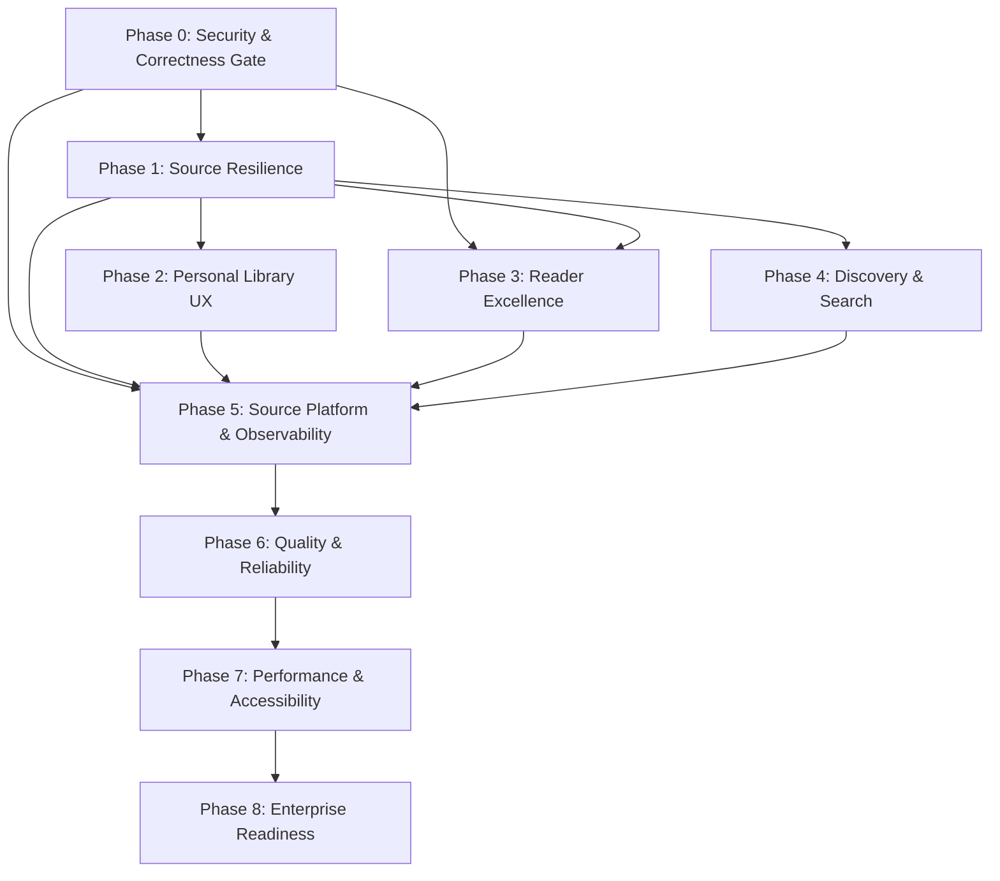

# MASTER_PLAN.md — Yomirra Engineering Master Plan

> **Version:** 1.0  
> **Created:** 2026-09-13  
> **Authority:** This document is the long-lived architectural and execution contract for Yomirra.  
> **Baseline:** `audit_report_2.md` (2026-09-13) — current accepted engineering baseline.  
> **Status:** PENDING APPROVAL

---

## Document Authority & Change-Control Policy

### Authority Hierarchy

```
1. User's explicit request in the current conversation
2. This MASTER_PLAN.md (after approval)
3. audit_report_2.md (current engineering baseline)
4. Canonical project documentation (docs/*.md, GEMINI.md)
5. AUDIT_REPORT.md (historical context only — formally superseded)
```

### Change-Control Model

#### Normal Implementation

Each phase gets its own branch:

```
phase/0-security-correctness
phase/1-source-resilience
phase/2-personal-library
phase/3-reader-excellence
phase/4-discovery-search
phase/5-source-platform
phase/6-quality-reliability
phase/7-performance-accessibility
phase/8-enterprise-readiness
```

A phase branch starts only after the previous phase's exit gate is satisfied.

#### New Scope Discovered Later

Do NOT silently rewrite MASTER_PLAN.md. Create an amendment branch:

```
amendment/MP-XXX-short-description
```

The amendment must document:

- New evidence that triggered it
- Why the existing plan is insufficient
- Affected phases
- Compatibility/migration impact
- Whether it is a blocker or enhancement
- Proposed plan delta

Only merge after explicit approval.

#### Small Implementation Findings

Normal bugs, refactors, or implementation details that do not alter architecture or phase scope do NOT require a master-plan amendment. Track them in `EXECUTION_TRACKER.md` under the relevant phase.

#### Emergency Production Issue

```
hotfix/<issue>
```

Reconcile the result back into the execution tracker afterward.

### Branch Execution Rules

Before implementation, agents must read:

```
MASTER_PLAN.md
EXECUTION_TRACKER.md
audit_report_2.md
```

and relevant project docs.

Agents may refine implementation tactics inside a phase. Agents may NOT:

- Reorder phases
- Silently expand architecture
- Replace core technology
- Introduce paid infrastructure
- Introduce a new database
- Rewrite major subsystems
- Change persistence semantics

unless an approved amendment explicitly permits it.

---

## Core Product Direction (Locked)

Yomirra is a mobile-first PWA manga/webtoon reader. The following are locked architectural assets to preserve and evolve:

| Asset | Status per Audit 2 |
|---|---|
| Next.js 16 App Router | Stable, production build succeeds |
| React 19 | Stable |
| Tailwind v4 CSS-first tokens | Comprehensive design system |
| Zustand v5 (12 stores, localStorage persistence) | Clean architecture, appropriate separation |
| TanStack Query v5 (server state) | Well-configured staleTime/gcTime |
| Firebase Auth + Firestore sync | Functional, needs session cleanup (A2-S04) |
| Redis caching (Upstash) | Well-structured TTLs, stale fallback |
| Local-first behavior | Core UX principle |
| PWA + Serwist service worker | Functional offline chapters |
| Virtualized continuous reader | Strong (audit-verified asset) |
| Paged reader (LTR/RTL) | Functional |
| Multi-source adapter architecture | 4 built-in + dynamic manifest |
| Offline download engine (Cache API) | Strong (audit-verified asset) |
| Design system (CSS custom properties) | Comprehensive dark/light tokens |
| Motion animation tokens | Shared token architecture |

**Do NOT propose a rewrite** unless concrete evidence proves a subsystem cannot support the target architecture. Reader and Download Engine are explicitly identified as strong assets.

---

## Constraints (Locked)

| Constraint | Details |
|---|---|
| Free-tier-first | No unnecessary paid infrastructure |
| No relational database | No PostgreSQL/Prisma unless amendment proves necessity |
| No Docker for local dev | `pnpm dev` remains the only dev command |
| PWA-first | No native iOS/Android requirement |
| No billing/monetization | Out of scope |
| No `eval()` / dynamic code execution | Defense already present (FP-04 verified) |
| Secure client/server boundaries | Layer rules are non-negotiable |
| Backward compatibility | Existing user library/history/download data must survive |
| Privacy of private sources | NEVER expose in public git |

"Enterprise-ready" means engineering maturity: security, reliability, maintainability, observability, accessibility, performance, automated testing, CI/CD quality gates, data safety, incident readiness, documentation, dependency governance, deployment/recovery procedures.

---

## Cross-Cutting Architecture Decisions

### State Ownership Model

| Domain | Owner | Persistence | Cloud Sync |
|---|---|---|---|
| Source data (popular/latest/search/detail/chapters/pages) | TanStack Query | In-memory + staleTime | No |
| Library items | Zustand `library-store` | localStorage | Firestore `users/{uid}/library` |
| Reading history | Zustand `history-store` | localStorage | Firestore `users/{uid}/history` |
| Collections | Zustand `collection-store` | localStorage | No (local only) |
| Reader preferences | Zustand `reader-store` | localStorage | No |
| App settings | Zustand `settings-store` | localStorage | Partial |
| Source preferences | Zustand `source-preferences-store` | localStorage + cookie | Firestore `users/{uid}/preferences` |
| Update tracking | Zustand `update-store` | localStorage | No (local only) |
| Download queue/status | Zustand `download-store` | localStorage | No (local only) |
| Downloaded chapter images | Cache API | Browser storage | No (local only) |
| Search filters (transient) | Zustand `search-filter-store` | Volatile | No |
| Library filters (transient) | Zustand `library-filter-store` | Volatile | No |
| Route state (transient) | Zustand `route-state-store` | Volatile | No |
| Reading stats (transient) | Zustand `stats-store` | Volatile | No |

**Rule:** Do not duplicate server state in Zustand when TanStack Query already owns it. Do not create new Zustand stores for data that is better served by TanStack Query.

### Schema Evolution Policy

All persisted state (localStorage, Firestore, Cache API, backup files) must use versioned migrations:

- Every schema change increments a version number
- Migration functions transform old shape → new shape
- Failed migrations must not corrupt existing data (rollback or preserve original)
- Backup/restore must handle all supported schema versions
- No destructive silent migration — user must not lose data without warning

### Security Boundary Map

```
┌─────────────────────────────────────────────────┐
│ BROWSER (Untrusted)                              │
│  ├── React UI Components                         │
│  ├── Zustand Stores (localStorage)               │
│  ├── Firebase Client SDK (auth only)             │
│  ├── Service Worker (Cache API)                   │
│  └── Dynamic Source Registry (client manifest)    │
├──────────────── TRUST BOUNDARY ──────────────────┤
│ NEXT.JS API ROUTES (Server, partially trusted)    │
│  ├── Rate Limiter (Redis, fail-open)             │
│  ├── Source Manager                              │
│  ├── SSRF Guard (Phase 0 — TO BE BUILT)          │
│  └── Image Proxy (HMAC-signed)                   │
├──────────────── TRUST BOUNDARY ──────────────────┤
│ EXTERNAL SERVICES (Untrusted)                     │
│  ├── Manga Source APIs/Sites                      │
│  ├── Dynamic Source Manifest URLs                 │
│  ├── Image CDNs                                   │
│  └── Cloud Metadata (169.254.169.254)            │
├──────────────── MANAGED SERVICES ────────────────┤
│  ├── Redis (Upstash — caching)                   │
│  ├── Firebase/Firestore (auth + sync)            │
│  └── Vercel (deployment)                         │
└─────────────────────────────────────────────────┘
```

Boundaries accepting untrusted input:
- API routes: query params (`sourceId`, `mangaId`, `chapterId`, `manifestUrl`, `page`, search `q`, filters)
- Image proxy: `url` + `sig` query params
- Dynamic source: manifest JSON from arbitrary URLs

### Error Taxonomy

| Category | Code | Meaning |
|---|---|---|
| Source unavailable | `SOURCE_UNAVAILABLE` | Source API/site unreachable or returning errors |
| Source malformed | `SOURCE_MALFORMED` | Source returned data that failed normalization |
| Rate limited | `RATE_LIMITED` | Client or upstream rate limit exceeded |
| Network unavailable | `NETWORK_UNAVAILABLE` | Browser or server network connectivity lost |
| Authentication failure | `AUTH_FAILURE` | Firebase auth session expired or invalid |
| Storage failure | `STORAGE_FAILURE` | localStorage/Cache API/IndexedDB quota or error |
| Validation failure | `VALIDATION_FAILURE` | Input failed Zod schema validation |
| Security rejection | `SECURITY_REJECTION` | SSRF guard, cache isolation, or trust boundary violation |
| Not found | `NOT_FOUND` | Requested resource does not exist |
| Unknown internal | `INTERNAL_ERROR` | Unexpected server error (do not expose raw details) |

Do not expose raw internal error messages, stack traces, or upstream response bodies to the client.

---

## Phase 0 — Security & Correctness Gate

### Objective

Eliminate all P0/P1 security vulnerabilities and correctness defects that block safe feature development. This phase is a hard gate — no subsequent phase may begin until Phase 0's exit criteria are met.

### Current Evidence

| Finding | Severity | Status | Location |
|---|---|---|---|
| A2-S01: SSRF via `manifestUrl` | P0 | CONFIRMED_OPEN | `source-manager.ts:8-12` |
| A2-S02: Redis cache poisoning / built-in impersonation | P0 | CONFIRMED_OPEN | `[sourceId]/latest/route.ts:30-37` |
| A2-S03: Image proxy SSRF via dynamic source URLs | P1 | CONFIRMED_OPEN | `proxy/image/route.ts:31-47` |
| A2-S04: Auth session cross-contamination | P1 | CONFIRMED_OPEN | `use-sync.ts:208-228`, `use-auth.ts:54-58` |
| B01: NSFW filter fails open | P1 | CONFIRMED_OPEN | `use-nsfw-source-ids.ts:27-30` |
| B03/E04: Firestore history full-scan | P1 | CONFIRMED_OPEN | `sync-utils.ts:74-88` |
| A2-B02: Stale SW cache matcher | P2 | CONFIRMED_OPEN | `sw.ts:45-55` |

### Deliverables

1. **SSRF Guard** (`src/server/lib/security/ssrf.ts`)
   - Validate all outbound URLs before `fetch()`
   - Block: loopback (`127.0.0.0/8`, `::1`), link-local (`169.254.0.0/16`, `fe80::/10`), private RFC1918 (`10.0.0.0/8`, `172.16.0.0/12`, `192.168.0.0/16`), cloud metadata (`169.254.169.254`)
   - Validate protocol: only `http:` and `https:`
   - Handle redirect following — validate resolved IP after redirect

2. **Built-in Source Protection** in `source-manager.ts`
   - Reject `manifestUrl` parameter when `sourceId` matches any built-in adapter ID
   - Enforce `manifest.id === sourceId` for dynamic sources
   - Return clear `SECURITY_REJECTION` error

3. **Dynamic Source Cache Isolation** across all `[sourceId]` API routes
   - Dynamic source cache keys: `source:dynamic:${sha256(manifestUrl).slice(0,16)}:${sourceId}:${endpoint}:${params}`
   - Built-in source cache keys remain: `source:${sourceId}:${endpoint}:${params}`
   - No namespace collision possible between dynamic and built-in

4. **Image Proxy Hardening** in `/api/proxy/image/route.ts`
   - Apply SSRF guard to target URL before fetching
   - Validate resolved IP is public internet
   - Validate `Content-Type` starts with `image/`
   - Reject non-image responses

5. **Auth Session Cleanup** in `use-sync.ts` and `use-auth.ts`
   - Capture `unsubPreferences` callback in `useEffect` cleanup
   - On `logout()`: clear ALL user-scoped stores: `library-store`, `history-store`, `collection-store`, `source-preferences-store`, `update-store`, `stats-store`
   - Verify no stale Firestore listener survives logout

6. **NSFW Fail-Closed** in `use-nsfw-source-ids.ts`
   - Cache last-known NSFW IDs in localStorage
   - On API failure: use cached IDs if available, otherwise default-deny (treat all sources as potentially NSFW)
   - Remove fail-open `return []` path

7. **Firestore Query Fix** in `sync-utils.ts`
   - Add `where("sourceId", "==", sourceId)` and `where("mangaId", "==", mangaId)` to `deleteMangaHistory`
   - Create composite Firestore index if required
   - Eliminate full-collection scan

8. **Service Worker Matcher Fix** in `sw.ts`
   - Update stale `/api/manga` matcher to `/api/sources/`

### Workstreams

| # | Workstream | Scope |
|---|---|---|
| W0.1 | SSRF + Cache Isolation | Items 1, 2, 3 |
| W0.2 | Image Proxy Hardening | Item 4 |
| W0.3 | Auth Lifecycle | Items 5, 6 |
| W0.4 | Firestore + SW Correctness | Items 7, 8 |
| W0.5 | Security Regression Tests | All items |

### Dependencies

None — Phase 0 has no prerequisites.

### Data / Migration Impact

- No schema changes required
- Cache key format change for dynamic sources only (existing dynamic source cache entries will naturally expire)
- No localStorage migration needed

### Security Impact

This IS the security phase. Every deliverable directly addresses a verified security finding.

### UX Impact

- NSFW fail-closed may temporarily hide content when API is down (correct behavior)
- Auth logout will clear more stores (correct behavior — prevents data leakage)
- No visible UI changes

### Testing Strategy

Create `src/server/lib/security/__tests__/`:

- `ssrf.test.ts`: unit tests for IP/protocol validation against all blocked ranges
- `cache-isolation.test.ts`: verify dynamic and built-in cache keys never collide
- `source-manager.test.ts`: verify built-in ID rejection with `manifestUrl`

Create `src/shared/hooks/__tests__/`:

- `use-auth-teardown.test.ts`: verify all stores cleared on logout
- `use-nsfw-failclosed.test.ts`: verify fail-closed behavior

Update existing tests:

- Image proxy tests: add SSRF rejection cases
- Firestore sync tests: verify scoped deletion query

### Acceptance Criteria

- [ ] SSRF guard blocks all loopback/link-local/private/metadata IPs (test-verified)
- [ ] `manifestUrl` on built-in source IDs returns error (test-verified)
- [ ] Dynamic source cache keys use `source:dynamic:` prefix (test-verified)
- [ ] Image proxy rejects internal IP targets (test-verified)
- [ ] Logout clears all user-scoped stores (test-verified)
- [ ] No stale Firestore listener after logout (test-verified)
- [ ] NSFW filter uses cached IDs on API failure (test-verified)
- [ ] `deleteMangaHistory` uses compound query (code-verified)
- [ ] SW matcher targets `/api/sources/` (code-verified)
- [ ] `pnpm typecheck` passes
- [ ] `pnpm test --run` passes (all existing + new security tests)
- [ ] `pnpm build` succeeds

### Exit Gate

All acceptance criteria met. Security regression test suite exists and passes. No P0 or P1 security findings remain open from Audit 2.

### Explicitly Out of Scope

- Reader changes
- UI/UX redesign
- New features
- Performance optimization
- Dynamic source platform expansion
- Documentation updates (beyond security-relevant changes)

### Risks

| Risk | Mitigation |
|---|---|
| SSRF guard may block legitimate dynamic source URLs that resolve to unexpected IPs | Guard validates resolved IP, not hostname. Public IPs pass through. |
| Firestore compound query may need index creation | Document index requirement. Firestore indexes can be created via console. |
| Cache key format change may cause temporary cache misses for dynamic sources | Acceptable — dynamic source data refreshes within TTL. |

### Rollback / Recovery

- SSRF guard: remove guard import from source-manager and proxy route
- Cache isolation: revert cache key format (old keys expire naturally)
- Auth cleanup: revert logout handler
- All changes are localized and independently revertable

---

## Phase 1 — Source Resilience & Identity Foundation

### Objective

Design and implement the minimum durable identity layer that allows users to preserve their library, history, and reading progress when a source becomes unavailable or they switch to an alternate source.

### Current Evidence

From Audit 2 §5-6:

- Source identity is a single string (`sourceId`). Every domain model embeds it.
- Key format: `${sourceId}::${mangaId}` (library), `${sourceId}::${mangaId}::${chapterId}` (history)
- Zero cross-source deduplication exists
- Zero source migration capability exists
- Source disappearance → dead library entries, 404/500 errors
- No source fallback mechanism
- Audit 2 recommends: lightweight client/server heuristic Title Normalizer & Linker, NOT a heavy canonical database

### Deliverables

1. **Title Identity Model**
   - Each saved manga gets a stable user-facing identity (the user's "saved title")
   - Primary source reference: the `sourceId::mangaId` where the user first saved it
   - Alternate source references: optional array of `{sourceId, mangaId, confidence, addedAt}`
   - Manual override: user can confirm/reject suggested matches

2. **Title Normalizer** (`src/shared/lib/title-normalizer.ts`)
   - Normalize manga titles for matching: lowercase, strip punctuation, normalize whitespace, handle common variants
   - Matching confidence score (exact, high, medium, low)
   - Support alternate titles from `MangaDetail.title` + any `altTitles` if sources provide them
   - NOT a full-text search engine — heuristic string matching for the same work across sources

3. **Source Link Store Extension**
   - Extend `library-store` with optional `alternateSourceLinks` field
   - Migration: add field with default `[]` — backward compatible
   - Firestore: extend document schema — backward compatible (new field, no breaking change)

4. **Source Migration Flow**
   - When primary source fails: show "Source unavailable" state with "Find alternate source" action
   - Search across enabled sources using normalized title
   - Present matches with confidence indicator
   - User confirms match → update primary source reference, preserve history/progress
   - Chapter progress mapping: best-effort by chapter number (not chapter ID, since IDs differ per source)

5. **Dead Source Recovery**
   - Library items with unavailable primary source show clear status indicator
   - User can manually search and relink
   - Offline-downloaded chapters remain accessible regardless of source status

6. **Backward Compatibility**
   - Existing `sourceId::mangaId` key format preserved
   - Old library data works without migration (new fields are optional)
   - Backup schema v4: extends v3 with `alternateSourceLinks`
   - Restore from v3 backup works (missing field = empty array)

### Workstreams

| # | Workstream | Scope |
|---|---|---|
| W1.1 | Title Normalizer | Item 2 |
| W1.2 | Store Schema Extension | Items 3, 6 |
| W1.3 | Source Link UI + Migration Flow | Items 1, 4 |
| W1.4 | Dead Source Recovery | Item 5 |

### Dependencies

- Phase 0 complete (security gate satisfied)

### Data / Migration Impact

- `library-store` schema version increment
- localStorage migration: add `alternateSourceLinks: []` to existing items
- Firestore: new optional field on library documents (non-breaking)
- Backup schema: v4 with backward compatibility for v3 restore
- Chapter progress mapping by chapter number is best-effort (some series may have inconsistent numbering across sources)

### Security Impact

- Title normalizer operates on already-fetched data — no new external requests
- Source link suggestions come from existing search API — same security boundary
- No new trust boundaries introduced

### UX Impact

- Library items show source availability status
- "Find alternate source" flow for unavailable sources
- Confidence indicators for suggested matches
- Manual confirm/reject for source linking
- Reading progress transfer is best-effort with clear user communication

### Testing Strategy

- Unit tests for title normalizer (exact, high, medium, low confidence scenarios)
- Unit tests for chapter number mapping
- Store migration tests (v3 → v4)
- Backup/restore tests with old and new schema versions
- Integration tests for source link flow

### Acceptance Criteria

- [ ] Title normalizer produces correct confidence scores for known test cases
- [ ] Library items with unavailable source show clear status
- [ ] User can search for alternate source and link it
- [ ] Reading progress transfers by chapter number on source switch
- [ ] Old library data works without manual migration
- [ ] Backup v3 restores correctly into v4 schema
- [ ] `pnpm typecheck` passes
- [ ] `pnpm test --run` passes

### Exit Gate

Users can relink a manga whose primary source went offline to an alternate source while preserving reading progress. Schema migration is backward compatible.

### Explicitly Out of Scope

- Automatic background source matching (user-initiated only in Phase 1)
- Multi-source chapter merging (reading from multiple sources simultaneously)
- Full-text search or fuzzy matching engine
- Database for canonical title entities
- Changes to route URL format

### Risks

| Risk | Mitigation |
|---|---|
| Title normalization may produce false positives for similar but different works | Confidence scoring + manual user confirmation required |
| Chapter numbering inconsistency across sources | Best-effort mapping + user can adjust |
| Schema migration on large libraries may be slow | Migration runs incrementally on store hydration |

### Rollback / Recovery

- Revert store schema version — old data preserved, new fields ignored
- Title normalizer is a pure utility — removing it has no persistence impact

---

## Phase 2 — Personal Library UX

### Objective

Redesign the personal library experience around the source-resilient domain model from Phase 1, eliminating the redundant `/library` vs `/bookmark` dual taxonomy identified in A2-U01.

### Current Evidence

From Audit 2 §8:

- `/library`: all saved manga with search, status filters, sorting
- `/bookmark`: two tabs — "Sedang Dibaca" (reading history) and "Koleksi" (custom collections)
- A2-U01 (P2): cognitive confusion between Library and Bookmark
- 12 Zustand stores — `library-store`, `history-store`, `collection-store` are the relevant persisted stores
- `update-store` tracks chapter releases for library items

### Deliverables

1. **Unified Personal Hub** at `/library`
   - Tabs/sections: Saved Manga, Reading History, Collections, Updates
   - Replace current `/bookmark` route — redirect for backward compatibility
   - Single navigation entry point

2. **Source Availability State in Library**
   - Each library item shows source status (available, slow, unavailable, unknown)
   - Unavailable items have "Relink" action (Phase 1 foundation)
   - Clear visual distinction without hiding unavailable items

3. **Continue Reading**
   - Prominent "Continue Reading" section based on history-store
   - Shows last-read chapter with progress, source status
   - One-tap resume to reader

4. **Unread/New Chapter Indicators**
   - Based on update-store data
   - Badge on library items with new chapters since last read
   - Clear visual hierarchy: unread count, last chapter read, latest available

5. **Responsive Information Architecture**
   - Mobile: compact cards, horizontal scroll rails for quick access sections
   - Desktop: denser grid, sidebar filters where appropriate
   - Consistent use of existing card archetypes (`ShelfCard`, `HistoryCard`)

6. **Navigation Update**
   - Update `nav.ts` to remove `/bookmark`, keep `/library` as unified personal section
   - Bottom nav icon update if needed
   - Route redirect from `/bookmark` → `/library`

### Workstreams

| # | Workstream | Scope |
|---|---|---|
| W2.1 | Information Architecture & Routes | Items 1, 6 |
| W2.2 | Source Status Integration | Item 2 |
| W2.3 | Continue Reading | Item 3 |
| W2.4 | Update Indicators | Item 4 |
| W2.5 | Responsive Layout | Item 5 |

### Dependencies

- Phase 1 complete (source identity model available for source status display)

### Data / Migration Impact

- No store schema changes — this phase is presentation-only over existing stores
- Route change: `/bookmark` → redirect to `/library`
- Navigation configuration change in `nav.ts`

### Security Impact

None.

### UX Impact

Major — this is a UX phase. Eliminates dual taxonomy confusion. Unifies all personal content management into one coherent section.

### Testing Strategy

- Update existing bookmark page tests to cover unified library
- Component tests for new/modified sections
- Integration tests for continue-reading flow
- Browser smoke tests for responsive layout
- Verify route redirect works

### Acceptance Criteria

- [ ] Single `/library` route contains all personal content sections
- [ ] `/bookmark` redirects to `/library`
- [ ] Source availability status visible on library items
- [ ] Continue Reading section functional
- [ ] Unread chapter indicators visible
- [ ] Mobile and desktop layouts tested
- [ ] No duplicate navigation concepts
- [ ] Existing library data renders correctly
- [ ] `pnpm typecheck` passes
- [ ] `pnpm test --run` passes

### Exit Gate

Unified personal library with clear information hierarchy. Zero cognitive confusion between library/bookmark. Source status visible.

### Explicitly Out of Scope

- Bulk management beyond existing selection patterns
- Social features (sharing, public lists)
- AI recommendations
- Advanced sorting algorithms
- Automatic collection generation

### Risks

| Risk | Mitigation |
|---|---|
| Users accustomed to `/bookmark` may be confused by route change | Redirect + brief onboarding toast |
| Tab count may grow unwieldy | Start with 4 tabs, evaluate after user testing |

### Rollback / Recovery

- Restore original `/bookmark` route
- Revert nav.ts changes
- No data loss — presentation-only changes

---

## Phase 3 — Reader Excellence

### Objective

Evolve the existing reader architecture to production-grade reliability and world-class reading experience. Preserve the strong virtualization and gesture foundations.

### Current Evidence

From Audit 2 §7:

**Strengths (preserve):**
- Virtualized continuous reader with `@tanstack/react-virtual` + measurement caching
- `@use-gesture/react` with pinch-to-zoom (1x-4x)
- Data saver integration (quality adjustment)
- Multi-mode: continuous vertical + paged (LTR/RTL)

**Reliability gaps (fix):**
- A2-B03 (P2): Dead `IntersectionObserver` with empty callback at `continuous-vertical-reader.tsx:120-125`
- Incomplete `StreamItem` divider architecture (planned multi-chapter stream, half-implemented)
- A2-B04 (P2): Hardcoded Discord link for all sources at `continuous-vertical-reader.tsx:273`
- A2-P01 (P3): Fixed 1200px virtualizer estimate (no material shift reproduced)

### Deliverables

#### Reliability Requirements (Must)

1. **Remove dead IntersectionObserver** (A2-B03)
   - Remove empty callback observer at bottom of stream
   - If multi-chapter stream loading is to be implemented, implement it properly with real callback
   - If not implementing now, remove `StreamItem.divider` type until needed

2. **Source-aware chapter reporting** (A2-B04)
   - Replace hardcoded Discord link with source-aware reporting
   - If source provides report URL: use it
   - If not: link to Yomirra issue tracker or generic report

3. **Chapter/source failure recovery**
   - When chapter pages fail to load: show retry button with error context
   - When source is unavailable mid-read: offer alternate source (Phase 1 foundation)
   - Image retry with exponential backoff (per-image, not page-level)

4. **Progress persistence reliability**
   - Verify page progress saves correctly on unmount, navigation, and app backgrounding
   - Verify resume position on reader reopen

5. **Offline reading behavior**
   - Verify downloaded chapters render correctly when offline
   - Handle mixed online/offline state (some chapters cached, some not)

#### World-Class Enhancements (Should)

6. **Seamless multi-chapter continuation**
   - Only implement if UX/runtime testing justifies the complexity
   - Decision gate: build a prototype, measure load times and memory impact, then decide
   - If implementing: proper `StreamItem.divider` architecture with chapter boundary markers

7. **Desktop double-page spread**
   - Paged reader: option to display two pages side-by-side on wide viewports
   - LTR/RTL page ordering must be correct
   - Single-page fallback for odd page counts and chapter boundaries

8. **Keyboard navigation**
   - Arrow keys: page navigation in paged reader
   - Space/Shift+Space: scroll in vertical reader
   - Escape: exit fullscreen / close overlay
   - Number keys: jump to page (if practical)

9. **Configurable tap zones**
   - Only if user testing shows the default zones are insufficient
   - Left/center/right tap zones for prev/menu/next in paged reader
   - Visual zone indicator on first use

10. **Fullscreen mode**
    - Toggle fullscreen via Fullscreen API where supported
    - Auto-hide toolbar in fullscreen

### Workstreams

| # | Workstream | Scope |
|---|---|---|
| W3.1 | Reliability Fixes | Items 1-5 |
| W3.2 | Multi-chapter Prototype | Item 6 (decision gate) |
| W3.3 | Desktop Spread | Item 7 |
| W3.4 | Input Methods | Items 8, 9 |
| W3.5 | Fullscreen + Polish | Item 10 |

### Dependencies

- Phase 0 complete
- Phase 1 complete (for source-aware fallback in Item 3)

### Data / Migration Impact

None — reader preferences are already persisted in `reader-store`.

### Security Impact

None.

### UX Impact

Major — reader is the core product surface. All changes must preserve the existing fluid reading experience while adding capabilities.

### Testing Strategy

- Reader component tests: verify error states, retry behavior, progress persistence
- Paged reader tests: LTR/RTL correctness, double-page spread layout
- Keyboard navigation tests
- Memory profiling for multi-chapter stream (if pursued)
- Browser smoke tests for mobile vertical reader, desktop paged reader
- Accessibility testing: keyboard, focus management, reduced motion

### Acceptance Criteria

- [ ] Dead IntersectionObserver removed (A2-B03)
- [ ] Chapter reporting is source-aware (A2-B04)
- [ ] Image retry with backoff functional
- [ ] Progress saves/resumes correctly
- [ ] Offline chapters render correctly
- [ ] Keyboard navigation works in paged reader
- [ ] Desktop double-page spread renders correctly (LTR and RTL)
- [ ] `prefers-reduced-motion` respected for all new animations
- [ ] `pnpm typecheck` passes
- [ ] `pnpm test --run` passes

### Exit Gate

Reader reliability items complete. At least one world-class enhancement (keyboard navigation or desktop spread) shipped. No reader regression.

### Explicitly Out of Scope

- Reader architecture rewrite
- Custom page transition animations
- Manga panel detection / smart cropping
- Text-to-speech
- Community annotations

### Risks

| Risk | Mitigation |
|---|---|
| Multi-chapter stream may cause memory pressure on low-end devices | Prototype with memory profiling before committing |
| Double-page spread aspect ratio varies widely | Allow user to toggle; smart single-page fallback |

### Rollback / Recovery

- Each enhancement is independently removable
- Reliability fixes are minimal and localized

---

## Phase 4 — Discovery & Search Excellence

### Objective

Build a multi-source discovery and search experience that handles cross-source presentation, duplicate detection, partial source failure, and capability-aware filtering.

### Current Evidence

From Audit 2 §5, §8:

- Multi-source parallel search exists via `useSearchCatalog` + TanStack Query
- Zero cross-source deduplication
- Filter capability mismatch: `api-client.ts` blindly appends `-adult`/`-mature` tags that some sources ignore
- Komiku completely discards filters; Komikindo sends literal `-adult` as genre slug
- Source capability `SourceCapabilities` interface exists but filter capabilities are not modeled

### Deliverables

1. **Cross-source duplicate grouping**
   - Group search results that likely represent the same manga across sources
   - Use Phase 1 title normalizer for matching
   - Primary result + "Also available on: [source badges]"
   - Do NOT hide lower-confidence matches — show them separately

2. **Capability-aware filter handling**
   - Model filter capabilities per source (which sources support genre exclusion, status filter, etc.)
   - Filter drawer dynamically reflects intersection of selected sources' capabilities
   - Unsupported filters: clearly indicate "not supported by [source]" rather than silently sending invalid params

3. **Partial source failure**
   - When one source fails during search: show results from successful sources
   - Show clear error indicator for failed source
   - Retry button per failed source
   - Do not block entire search on single source failure (already partially implemented)

4. **Source and language visibility**
   - Source badge on search result cards
   - Language indicator where sources serve different languages
   - Source reliability indicator if health data available (Phase 5)

5. **Popular/Latest feeds**
   - Multi-source popular/latest with source attribution
   - Configurable source order/priority
   - Partial failure: show available sources' feeds

6. **Search UX refinements**
   - Search history (localStorage, last N queries)
   - Loading/empty/error states per source in multi-source view
   - Clear "no results" messaging with suggestions

### Workstreams

| # | Workstream | Scope |
|---|---|---|
| W4.1 | Duplicate Grouping | Item 1 |
| W4.2 | Capability-Aware Filters | Item 2 |
| W4.3 | Partial Failure Handling | Item 3 |
| W4.4 | Source/Language Visibility | Item 4 |
| W4.5 | Feed & Search UX | Items 5, 6 |

### Dependencies

- Phase 1 complete (title normalizer for duplicate grouping)

### Data / Migration Impact

- Search history: new localStorage key, no migration needed
- Filter capability model: extends `SourceCapabilities` interface (non-breaking)

### Security Impact

None — search operates through existing API routes.

### UX Impact

Major — discovery is the second core product surface after reader.

### Testing Strategy

- Unit tests for duplicate grouping algorithm
- Integration tests for partial source failure
- Filter capability tests per source
- Search flow integration tests
- Browser smoke tests for responsive search layout

### Acceptance Criteria

- [ ] Cross-source search results grouped by likely same work
- [ ] Filter drawer reflects source capabilities
- [ ] Unsupported filters clearly indicated
- [ ] Partial source failure shows successful results + error for failed
- [ ] Source badge visible on search results
- [ ] Popular/latest feeds show multi-source content
- [ ] `pnpm typecheck` passes
- [ ] `pnpm test --run` passes

### Exit Gate

Multi-source search with duplicate grouping, capability-aware filters, and graceful partial failure.

### Explicitly Out of Scope

- Global ranking algorithm dependent on single source
- Recommendation engine
- Collaborative filtering
- Content-based recommendations
- AI-powered search

### Risks

| Risk | Mitigation |
|---|---|
| Duplicate grouping false positives | Confidence thresholds + "group" display rather than hard merge |
| Filter capability discovery requires per-source work | Start with known capabilities, expand incrementally |

### Rollback / Recovery

- Duplicate grouping can be disabled (show ungrouped results)
- Filter capabilities fall back to current behavior

---

## Phase 5 — Source Platform & Observability

### Objective

Harden the dynamic source platform with strict trust boundaries and build production observability for source health, API failures, and system degradation.

### Current Evidence

From Audit 2 §4-5:

- Dynamic source adapter uses pure string replacement and `fetch()` — no `eval()` (FP-04 verified)
- No namespace separation between built-in and dynamic sources (fixed in Phase 0)
- Hardcoded health stats in `source-registry.ts` (B06 confirmed)
- No real source health monitoring
- No alerting infrastructure

### Deliverables

#### Dynamic Source Platform

1. **Trust model documentation**
   - Define what dynamic sources can and cannot do
   - Document: can fetch data via JSON endpoints, cannot execute code, cannot access internal network (Phase 0 SSRF guard), cannot impersonate built-in sources (Phase 0 protection)

2. **Manifest validation hardening**
   - Zod schema already exists (`MihonSourceManifestSchema`) — extend with stricter URL validation
   - Validate `baseUrl` is public HTTPS
   - Validate endpoint patterns don't contain suspicious payloads
   - Version field enforcement

3. **Source versioning/update mechanism**
   - Dynamic source manifest version tracking
   - "Update available" indicator when manifest version changes
   - User-initiated update (re-fetch manifest)

4. **Source failure states**
   - Dynamic source unavailable: clear error state, retry, remove option
   - Manifest fetch failure: cached last-known manifest as fallback
   - Endpoint failure: per-endpoint error tracking

5. **Source SDK/DSL Decision Gate**
   - Evaluate whether a DSL is needed beyond the existing manifest approach
   - Decision criteria: can the manifest system handle real-world custom source needs?
   - If YES: document manifest as the official source authoring method
   - If NO: design minimal DSL extension (no `eval()`, no arbitrary code execution)
   - This is a decision, not mandatory implementation

#### Observability

6. **Source health monitoring**
   - Real health check loop: periodic HTTP check against `healthCheckUrl`
   - Record: latency, status code, last checked timestamp
   - Replace hardcoded `healthStats` with real measurements (B06)
   - Only display actual measured data — NEVER fabricate uptime percentages

7. **Structured logging**
   - Complete migration from `console.error` to structured logger (B07, E07)
   - Log categories: source, cache, auth, api, proxy, security
   - No raw error exposure to client

8. **Telegram alerting** (free-tier compatible)
   - Source outage alerts (when health check fails N consecutive times)
   - Redis degradation alerts
   - API error rate alerts
   - Configuration via env vars: `TELEGRAM_BOT_TOKEN`, `TELEGRAM_CHAT_ID`
   - Optional — system functions without Telegram configured

9. **Redis/Firebase degradation visibility**
   - Rate limiter fail-open state logging (E02 — document or add visibility)
   - Redis connection health on admin/health endpoint
   - Firebase sync failure logging

### Marketing/Landing Routing Decision

This remains **UNDECIDED**. Options for consideration:

- A: Keep `/` as app home, add `/about` for public info
- B: Dedicated marketing subdomain
- C: `/` as landing with `/app` as app home

Do not automatically replace `/`. This decision requires product input and is tracked as a future amendment if needed.

### Workstreams

| # | Workstream | Scope |
|---|---|---|
| W5.1 | Dynamic Source Hardening | Items 1-4 |
| W5.2 | SDK/DSL Decision | Item 5 |
| W5.3 | Health Monitoring | Item 6 |
| W5.4 | Logging & Alerting | Items 7, 8, 9 |

### Dependencies

- Phase 0 complete (security boundaries proven)
- Phases 1-4 complete for full platform context

### Data / Migration Impact

- New env vars for Telegram (optional)
- Health data storage: Redis keys for health metrics (TTL-based, no migration needed)
- Source registry: replace hardcoded `healthStats` with computed values

### Security Impact

- Manifest validation hardening reduces dynamic source attack surface
- Telegram bot token is a secret — must be in env, never committed

### UX Impact

- Real health stats instead of fake ones
- Source update indicators
- Better error messaging when sources fail

### Testing Strategy

- Health check integration tests
- Manifest validation tests (malicious payloads)
- Alerting tests (mock Telegram API)
- Logger migration verification

### Acceptance Criteria

- [ ] Hardcoded health stats removed (B06)
- [ ] Real health check loop operational
- [ ] Structured logger used consistently (B07, E07)
- [ ] Dynamic source manifest validation hardened
- [ ] Source update mechanism functional
- [ ] Telegram alerting sends on source outage (when configured)
- [ ] No fabricated uptime/health data anywhere
- [ ] SDK/DSL decision documented
- [ ] `pnpm typecheck` passes
- [ ] `pnpm test --run` passes

### Exit Gate

Real source health monitoring operational. Fabricated health stats eliminated. Dynamic source trust model documented. Observability operational.

### Explicitly Out of Scope

- Complex observability dashboards (Grafana, Datadog)
- APM instrumentation
- Custom analytics
- User behavior tracking

### Risks

| Risk | Mitigation |
|---|---|
| Health check may be rate-limited by sources | Respectful intervals (5-10 min), configurable |
| Telegram API changes | Simple HTTP POST, easily replaceable |

### Rollback / Recovery

- Health monitoring: disable check loop, revert to static display
- Alerting: optional by design, no system dependency

---

## Phase 6 — Quality, Reliability & Data Safety

### Objective

Establish comprehensive automated testing, data safety guarantees, and defined failure behavior for all critical system dependencies.

### Current Evidence

From Audit 2 §12:

- 35/35 test files pass, 175/175 tests pass
- Coverage by subsystem: Reader (High), Search (High), Library/History (Medium), Sources (Medium), Downloads (Low), Firebase Sync (**Critical Gap**), Dynamic Sources (**Critical Gap**)
- No E2E tests
- No PWA/offline tests

### Deliverables

#### Automated Testing Pyramid

1. **Unit test expansion**
   - Download engine tests
   - Firebase sync logic tests (mocked Firestore)
   - Dynamic source adapter tests
   - Backup/restore schema migration tests
   - Title normalizer tests (Phase 1)

2. **Integration tests**
   - API route integration tests (source resolution, caching, error handling)
   - Store interaction tests (library + history + collection cross-store flows)
   - Source migration flow tests (Phase 1)

3. **Security regression tests** (from Phase 0, maintained and expanded)
   - SSRF guard
   - Cache isolation
   - Auth teardown
   - NSFW fail-closed

4. **Browser E2E tests** (Playwright)
   Critical paths:
   1. Home → Search → Manga → Reader (pages render)
   2. Save → reload → Library persistence
   3. Reader progress → reload → resume position
   4. Download → simulated offline → read chapter
   5. Login → sync → logout → account isolation
   6. Vertical mobile reader
   7. Desktop paged reader
   8. Partial source outage → successful sources visible
   9. Alternate-source recovery (Phase 1 foundation)
   10. Backup → restore flow

5. **PWA/offline tests**
   - Service worker registration
   - Cached chapter access
   - Storage quota handling

#### Data Safety

6. **localStorage schema versioning**
   - Version field in every persisted store
   - Migration functions for each version increment
   - Rollback: preserve original data alongside migrated data until confirmed

7. **Firestore migration compatibility**
   - Document schema versioning for synced collections
   - Old clients read new schema (graceful field ignore)
   - New clients read old schema (migration on read)

8. **Backup/restore integrity**
   - Validate backup file before applying
   - Atomic restore: all-or-nothing for each store
   - Test with corrupt/partial/old backup files

9. **Failed migration rollback**
   - If migration fails: preserve original data, log error, notify user
   - User can export current data as backup before retry

10. **Stale cache/SW behavior**
    - Define service worker update lifecycle
    - Handle stale SW serving old cached routes
    - `skipWaiting` + `clientsClaim` behavior documented

#### Failure Engineering

11. **Defined failure behavior for each dependency:**

| Dependency | Failure Behavior |
|---|---|
| Firebase unavailable | App functions offline-first. Sync paused. Resume on reconnect. |
| Redis unavailable | Rate limiting fails open (documented). Cache misses hit source directly. |
| Individual source unavailable | Source marked unavailable. Other sources unaffected. Library shows status. |
| All sources unavailable | Clear "all sources unavailable" message. Cached data still accessible. Offline chapters readable. |
| Image host unavailable | Per-image retry with backoff. Placeholder shown. |
| Browser storage quota exhausted | Warning banner (existing). Download queue paused. No data corruption. |
| Service worker stale/corrupt | Force update on next navigation. Cached data preserved. |
| Network interruption during download | Download paused. Resume on reconnect. Partial download state preserved. |
| Auth session expiration | Prompt re-login. Local data preserved. Sync resumes after auth. |

### Workstreams

| # | Workstream | Scope |
|---|---|---|
| W6.1 | Unit Test Expansion | Item 1 |
| W6.2 | Integration Tests | Item 2 |
| W6.3 | E2E Test Suite | Items 4, 5 |
| W6.4 | Data Safety | Items 6-10 |
| W6.5 | Failure Engineering | Item 11 |

### Dependencies

- Phases 0-5 complete (testing the complete feature set)

### Data / Migration Impact

- Schema versioning may require store format changes
- Migration functions for each store version

### Security Impact

- Security regression tests formalized as CI requirement

### UX Impact

- Better error messaging for failure states
- Storage warning improvements

### Testing Strategy

This IS the testing phase. The deliverables define the testing strategy itself.

### Acceptance Criteria

- [ ] Unit test coverage includes download engine, sync, dynamic sources, backup/restore
- [ ] Critical E2E paths (10 flows) automated
- [ ] Security regression suite maintained
- [ ] Schema versioning implemented for all persisted stores
- [ ] Backup/restore handles corrupt and old format files
- [ ] Each dependency failure has defined, tested behavior
- [ ] `pnpm typecheck` passes
- [ ] `pnpm test --run` passes (expanded suite)
- [ ] E2E suite passes

### Exit Gate

Testing pyramid established. Critical E2E flows automated. Data safety guarantees verified. Failure behavior defined and tested for all dependencies.

### Explicitly Out of Scope

- 100% line coverage targets (risk-based, not coverage-metric-based)
- Load testing / stress testing
- Chaos engineering
- Visual regression testing

### Risks

| Risk | Mitigation |
|---|---|
| E2E tests may be flaky | Stable selectors, deterministic waits, CI retry strategy |
| Playwright setup may require Docker for CI | Verify Vercel/GitHub Actions Playwright support first |

### Rollback / Recovery

Tests are additive — no rollback needed.

---

## Phase 7 — Performance, Accessibility & Compatibility

### Objective

Establish measurable performance budgets, meet WCAG 2.2 AA accessibility baseline, and define browser/device support policy with documented limitations.

### Deliverables

#### Performance

1. **Core Web Vitals budgets**

| Metric | Budget (mobile) | Budget (desktop) |
|---|---|---|
| LCP | ≤ 2.5s | ≤ 2.0s |
| FID/INP | ≤ 200ms | ≤ 100ms |
| CLS | ≤ 0.1 | ≤ 0.1 |

2. **Reader-specific budgets**
   - First page render: ≤ 1.5s on 4G connection
   - Page scroll frame rate: ≥ 55fps on mid-range Android
   - Image memory: no OOM on 100+ page chapter on device with 3GB RAM

3. **Performance profiling requirements**
   - Profile BEFORE any significant performance refactor
   - Document baseline measurements and improvement
   - No speculative micro-optimization without measurement

4. **Specific areas to profile:**
   - Initial load / bundle splitting
   - Mobile reader rendering
   - Image memory pressure during long chapters
   - Virtualizer behavior with large chapter page counts
   - Large library performance (500+ items)
   - Search concurrency with 4 sources
   - Firestore read behavior during sync
   - Redis/cache efficiency
   - Offline cache size impact on startup

5. **Bundle analysis**
   - Verify heavy modules (`jszip`, `file-saver`, `firebase`) remain dynamically imported
   - Identify any bundle size regressions

#### Accessibility (WCAG 2.2 AA target)

6. **Keyboard navigation**
   - All interactive elements focusable
   - Logical tab order
   - Skip-to-content link
   - Focus visible indicator

7. **Dialogs and drawers**
   - Focus trapped in open dialogs/drawers
   - Escape to close
   - Focus returns to trigger on close

8. **Touch targets**
   - Minimum 44×44px for primary mobile controls
   - Verify in reader, navigation, filter chips

9. **Screen reader**
   - Semantic HTML throughout
   - ARIA labels on icon-only buttons (already required by `IconButton`)
   - Meaningful alt text on images
   - Live regions for dynamic content updates

10. **Contrast**
    - Verify text/background contrast ratios meet AA (4.5:1 normal, 3:1 large)
    - Audit dark and light themes

11. **Reduced motion**
    - `prefers-reduced-motion` respected (partially implemented via `useSafeMotion`)
    - Verify all Motion animations have reduced-motion variants

12. **Zoom**
    - Page remains functional at 200% zoom
    - Reader pinch-to-zoom (already implemented) works correctly at browser zoom levels

#### Browser / Device Compatibility

13. **Support policy:**

| Browser | Support Level |
|---|---|
| Chromium desktop (Chrome, Edge) | Primary — full feature support |
| Chromium Android (Chrome) | Primary — full feature support |
| Safari/iOS PWA | Best-effort — document known limitations |
| Firefox desktop | Secondary — core features work |
| Firefox Android | Best-effort |

14. **Responsive breakpoints** (existing from design system):
    - base: mobile (< 640px)
    - sm: 640px
    - md: 768px
    - lg: 1024px
    - xl: 1280px

15. **Document known browser limitations:**
    - iOS PWA: Service Worker caching limitations
    - Firefox: View Transitions API support
    - Safari: Cache Storage quota differences

### Workstreams

| # | Workstream | Scope |
|---|---|---|
| W7.1 | Performance Profiling & Budgets | Items 1-5 |
| W7.2 | Accessibility Audit & Fixes | Items 6-12 |
| W7.3 | Compatibility Testing & Documentation | Items 13-15 |

### Dependencies

- Phases 0-6 complete (full feature set to measure/audit)

### Data / Migration Impact

None.

### Security Impact

None.

### UX Impact

Major — accessibility and performance directly impact usability.

### Testing Strategy

- Lighthouse CI for Core Web Vitals
- axe-core / axe-playwright for accessibility audit
- Manual keyboard navigation testing
- Manual screen reader testing (NVDA/VoiceOver)
- Cross-browser testing matrix
- Device lab testing where possible

### Acceptance Criteria

- [ ] Core Web Vitals within budget (measured, not estimated)
- [ ] WCAG 2.2 AA: no critical or serious violations (axe audit)
- [ ] Keyboard navigation functional for all primary flows
- [ ] Touch targets ≥ 44px on mobile
- [ ] Contrast ratios meet AA for both themes
- [ ] `prefers-reduced-motion` fully respected
- [ ] Browser support policy documented with known limitations
- [ ] `pnpm typecheck` passes
- [ ] `pnpm test --run` passes

### Exit Gate

Performance budgets met (measured). Accessibility baseline met (audited). Browser compatibility documented.

### Explicitly Out of Scope

- AAA accessibility compliance
- Native app development
- Progressive enhancement for IE/legacy browsers
- Server-side rendering performance (SSR is minimal in this PWA)

### Risks

| Risk | Mitigation |
|---|---|
| Low-end Android performance may not meet budgets | Define "tested device" baseline, document known limitations |
| Safari PWA limitations may prevent full feature parity | Document explicitly, do not promise what Safari doesn't support |

### Rollback / Recovery

Performance and accessibility improvements are incremental and independently revertable.

---

## Phase 8 — Enterprise / Production Readiness Gate

### Objective

Final engineering maturity gate. Establish CI/CD quality gates, security operations, release engineering, incident readiness, and canonical documentation.

"Enterprise" means engineering maturity, NOT enterprise monetization.

### Deliverables

#### CI/CD

1. **Quality gate pipeline:**

```
pnpm lint          → warnings allowed, 0 errors
pnpm typecheck     → 0 errors
pnpm test --run    → 0 failures
security tests     → 0 failures
pnpm build         → success
E2E critical path  → 0 failures (when CI infra supports)
```

- Lint/typecheck/unit failures: block merge
- Build failure: block deploy
- E2E failures: block deploy to production (warning on staging)

2. **GitHub Actions workflow**
   - On PR: lint, typecheck, unit tests, build
   - On merge to main: full suite + E2E + deploy

#### Security Operations

3. **Secret management**
   - All secrets via environment variables
   - `src/env.ts` Zod validation for all env vars
   - `.env.example` complete and accurate
   - No secrets in git history (verified)

4. **Dependency vulnerability process**
   - `pnpm audit` in CI
   - Monthly dependency review
   - Critical vulnerability: patch within 48h
   - High vulnerability: patch within 1 week

5. **Security headers**
   - Verify Next.js security headers in production
   - CSP where applicable without breaking external image sources
   - X-Frame-Options, X-Content-Type-Options

6. **SECURITY.md alignment**
   - Update to reflect actual security model
   - Responsible disclosure process
   - Security contact information

#### Observability

7. **Production visibility:**
   - App error reporting (free tier: Sentry free or Vercel analytics)
   - Source outage detection (Phase 5 health monitoring)
   - API failure logging (structured logger)
   - Cache degradation logging
   - Sync failure logging
   - Release health tracking

#### Release Engineering

8. **Versioning:** Semantic versioning (already `0.1.0` in package.json)
   - Increment on meaningful releases
   - CHANGELOG.md maintained

9. **Deployment validation:**
   - Pre-deploy: full CI gate passes
   - Post-deploy: smoke test critical paths
   - Rollback: Vercel instant rollback to previous deployment

10. **Service worker release behavior:**
    - New SW activates on next navigation
    - Document SW update UX (user may need to refresh)
    - No data loss during SW transition

11. **Data migration sequencing:**
    - Schema migrations run on client hydration
    - Verify old schema data survives deployment
    - Firebase schema changes are backward compatible

#### Incident Readiness

12. **Severity categories:**

| Severity | Definition | Response |
|---|---|---|
| SEV-1 | Data loss, security breach, total outage | Immediate response, rollback if possible |
| SEV-2 | Major feature broken, auth issues | Same-day response |
| SEV-3 | Single source outage, degraded performance | Next working day |
| SEV-4 | Minor UI issue, cosmetic | Next release cycle |

13. **Emergency procedures:**
    - Emergency source disable: set source `isEnabled: false` + deploy
    - Emergency dynamic source disable: block `manifestUrl` param globally
    - Cache purge: Redis `FLUSHDB` or targeted key deletion
    - Secret rotation: update env vars + deploy
    - Rollback: Vercel deployment rollback

14. **Incident process:**
    - Detect → Assess severity → Mitigate → Root cause → Fix → Postmortem
    - Postmortem for SEV-1 and SEV-2

#### Documentation

15. **Canonical documentation must cover:**

| Topic | File |
|---|---|
| Architecture | `docs/ARCHITECTURE.md` |
| Security model | `SECURITY.md` + `docs/SECURITY_MODEL.md` |
| Source system | `docs/ADDING_A_SOURCE.md` + `docs/SOURCES.md` |
| Identity model | `docs/IDENTITY.md` (Phase 1 output) |
| State ownership | `docs/SCHEMA.md` (updated) |
| Sync | `docs/SYNC.md` |
| PWA/Offline | `docs/PWA.md` |
| Testing | `docs/TESTING.md` (updated) |
| Deployment | `docs/DEPLOYMENT.md` |
| Disaster recovery | `docs/DISASTER_RECOVERY.md` |
| Contributing | `CONTRIBUTING.md` (updated) |
| Agent instructions | `GEMINI.md` (updated — 7→12 stores, etc.) |

16. **Documentation must match implementation.**
    - Any code change that affects documented behavior must update docs in the same PR.

### Workstreams

| # | Workstream | Scope |
|---|---|---|
| W8.1 | CI/CD Pipeline | Items 1-2 |
| W8.2 | Security Operations | Items 3-6 |
| W8.3 | Observability | Item 7 |
| W8.4 | Release Engineering | Items 8-11 |
| W8.5 | Incident Readiness | Items 12-14 |
| W8.6 | Documentation | Items 15-16 |

### Dependencies

- Phases 0-7 complete

### Data / Migration Impact

None directly — this phase is process and infrastructure.

### Security Impact

Formalizes security operations.

### UX Impact

None directly.

### Testing Strategy

- CI pipeline tests itself (meta-verification)
- Deployment rollback drill
- Incident response tabletop exercise

### Acceptance Criteria

- [ ] CI pipeline enforces all quality gates
- [ ] Dependency vulnerability process documented
- [ ] Security headers verified in production
- [ ] SECURITY.md updated
- [ ] Production observability operational
- [ ] Versioning and CHANGELOG maintained
- [ ] Deployment rollback tested
- [ ] SW release behavior documented and tested
- [ ] Incident severity categories defined
- [ ] Emergency procedures documented
- [ ] All documentation topics covered and current
- [ ] `GEMINI.md` updated to reflect actual codebase state
- [ ] `pnpm typecheck` passes
- [ ] `pnpm test --run` passes
- [ ] E2E suite passes
- [ ] CI pipeline green

### Exit Gate

All acceptance criteria met. Enterprise-readiness definition satisfied.

### Explicitly Out of Scope

- Enterprise SSO/SAML
- Multi-tenant architecture
- Paid monitoring tools (unless free tier insufficient)
- Custom CI/CD infrastructure (use GitHub Actions)

### Risks

| Risk | Mitigation |
|---|---|
| Documentation effort underestimated | Incremental updates during each phase, not a final dump |
| CI infra costs | GitHub Actions free tier for public repos |

### Rollback / Recovery

Process documents are additive. CI pipeline can be disabled if blocking.

---

## Definition of Enterprise-Ready

Yomirra reaches Enterprise-Ready status when ALL of the following are true:

### Security
- [ ] All P0/P1 security findings from Audit 2 are closed and regression-tested
- [ ] SSRF guard operational and tested
- [ ] Dynamic source cache isolation proven
- [ ] Auth session isolation verified
- [ ] No fabricated health/telemetry data
- [ ] Dynamic sources cannot escape trust boundaries
- [ ] Secret management follows documented process
- [ ] Dependency vulnerability process active

### Reliability
- [ ] Source failures degrade gracefully (partial outage shows available sources)
- [ ] User state survives expected migrations
- [ ] Backup/restore integrity verified
- [ ] Offline reading regression-tested
- [ ] Each dependency failure has defined, tested behavior
- [ ] Defined failure behavior for Firebase, Redis, sources, images, storage, SW, network, auth

### Testing
- [ ] Security regression tests exist and pass in CI
- [ ] Critical E2E flows automated (10 paths)
- [ ] Unit/integration test coverage includes download engine, sync, dynamic sources
- [ ] All tests pass in CI

### Quality Gates
- [ ] CI enforces: lint, typecheck, unit tests, security tests, build
- [ ] E2E tests run on deploy pipeline
- [ ] Merge requires passing checks

### Performance
- [ ] Core Web Vitals within defined budgets (measured)
- [ ] Reader performance profiled and verified

### Accessibility
- [ ] WCAG 2.2 AA baseline met (no critical/serious violations)
- [ ] Keyboard navigation functional
- [ ] Reduced motion respected

### Operations
- [ ] Production observability operational
- [ ] Deployment rollback documented and tested
- [ ] Incident severity categories and procedures defined
- [ ] Service worker release behavior documented

### Documentation
- [ ] Canonical documentation matches implementation
- [ ] Architecture, security, source, identity, state, sync, PWA, testing, deployment, disaster recovery documented
- [ ] Agent instructions (`GEMINI.md`) current

---

## Post-Enterprise Backlog

Features that do not satisfy the Phase 0-8 criteria but may be pursued after Enterprise-Ready status:

| Item | Rationale for deferral |
|---|---|
| Marketing/landing page | Routing strategy undecided; not required for engineering maturity |
| Social features (sharing, public lists) | Product feature, not engineering maturity |
| AI-powered recommendations | Product feature, not engineering maturity |
| Native app (Capacitor/etc.) | PWA-first constraint |
| Multi-language UI (i18n) | Product feature; currently Indonesian-first |
| Manga panel detection | Advanced reader feature, not reliability |
| Community annotations | Product feature |
| Advanced analytics dashboard | Beyond free-tier observability |
| Content moderation tools | Product feature |
| Custom reading lists/boards | Product feature (beyond Phase 2 collections) |

---

## Audit Finding Traceability

Every Audit 2 finding is accounted for:

| Finding | Phase | Status |
|---|---|---|
| A2-S01 (P0): SSRF via manifestUrl | Phase 0 | Planned |
| A2-S02 (P0): Redis cache poisoning | Phase 0 | Planned |
| A2-S03 (P1): Image proxy SSRF | Phase 0 | Planned |
| A2-S04 (P1): Auth cross-contamination | Phase 0 | Planned |
| B01 (P1): NSFW fail-open | Phase 0 | Planned |
| B03/E04 (P1): Firestore full-scan | Phase 0 | Planned |
| A2-B02 (P2): Stale SW matcher | Phase 0 | Planned |
| A2-B03 (P2): Dead IntersectionObserver | Phase 3 | Planned |
| A2-B04 (P2): Hardcoded Discord link | Phase 3 | Planned |
| A2-U01 (P2): Dual taxonomy | Phase 2 | Planned |
| A2-P01 (P3): Virtualizer estimate | Phase 3 | Planned (investigate) |
| A2-D01 (P3): Unused @radix-ui/react-separator | Phase 8 | Planned (cleanup) |
| B06 (Low): Hardcoded health stats | Phase 5 | Planned |
| B07/E07 (Low): Raw console.error | Phase 5 | Planned |
| B08 (Low): NSFW tag exclusion | Phase 4 | Planned |
| E01 (High): 80+ `any` types | Phase 6 | Planned (incremental) |
| E02 (Medium): Rate-limit fail-open | Phase 5 | Planned (document) |
| E03 (Medium): GEMINI.md store drift | Phase 8 | Planned |
| E05 (Medium): Missing test coverage | Phase 6 | Planned |
| E06 (Low): Unmemoized NSFW Set | Phase 0 | Planned (trivial fix) |
| E09 (Low): Unused dependency | Phase 8 | Planned |
| E10 (Low): pnpm-workspace.yaml | Phase 8 | Planned (annotate) |

### Audit 1 Reconciliation

| Audit 1 Finding | Current Status | Phase |
|---|---|---|
| B01: NSFW fail-open | CONFIRMED_OPEN → Phase 0 | 0 |
| B02: Production console.log | INCORRECT (dev-gated) — but un-gated logs exist in use-sync.ts, use-nsfw-patcher.ts | 5 |
| B03: Firestore full-scan | CONFIRMED_OPEN → Phase 0 | 0 |
| B04: Preferences listener leak | CONFIRMED_OPEN → Phase 0 (as A2-S04) | 0 |
| B05: Flaky search test | RESOLVED | — |
| B06: Hardcoded health stats | CONFIRMED_OPEN → Phase 5 | 5 |
| B07: Raw console.error | CONFIRMED_OPEN → Phase 5 | 5 |
| B08: NSFW tag exclusion | CONFIRMED_OPEN → Phase 4 | 4 |
| E01: any types | CONFIRMED_OPEN → Phase 6 (incremental) | 6 |
| E02: Rate-limit fail-open | CONFIRMED_OPEN → Phase 5 | 5 |
| E03: Doc drift | CONFIRMED_OPEN → Phase 8 | 8 |
| E04: Firestore query | CONFIRMED_OPEN → Phase 0 | 0 |
| E05: Missing test coverage | CONFIRMED_OPEN → Phase 6 | 6 |
| E06: Set construction | CONFIRMED_OPEN → Phase 0 (trivial) | 0 |
| E07: Logger consistency | CONFIRMED_OPEN → Phase 5 | 5 |
| E08: ext/index.min.json | RESOLVED | — |
| E09: Unused dependency | CONFIRMED_OPEN → Phase 8 | 8 |
| E10: pnpm-workspace.yaml | CONFIRMED_OPEN → Phase 8 | 8 |

---

## Dependency Graph



**Critical path:** P0 → P1 → P2 → P5 → P6 → P7 → P8

**Parallel opportunities:**
- Phase 3 (Reader) can start after Phase 0+1, parallel with Phase 2
- Phase 4 (Discovery) can start after Phase 1, parallel with Phase 2 and 3
- Observability aspects of Phase 5 can begin earlier if needed

---

*End of MASTER_PLAN.md v1.0*
