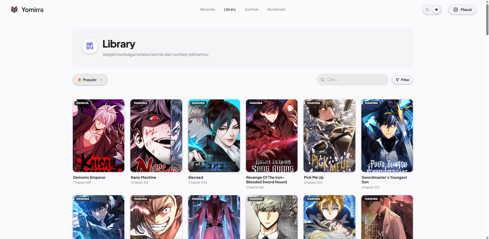
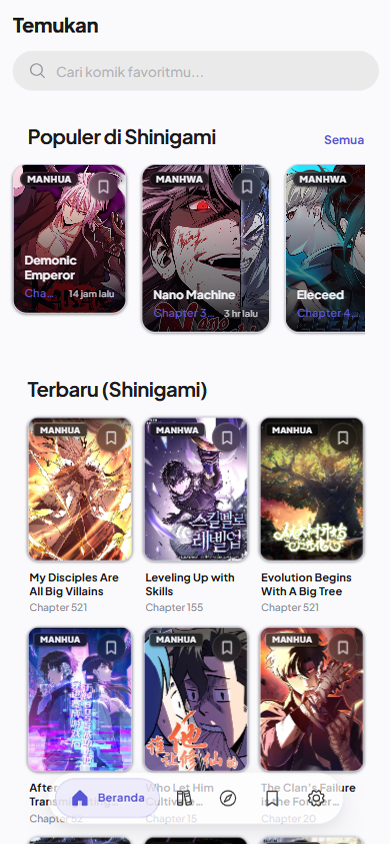
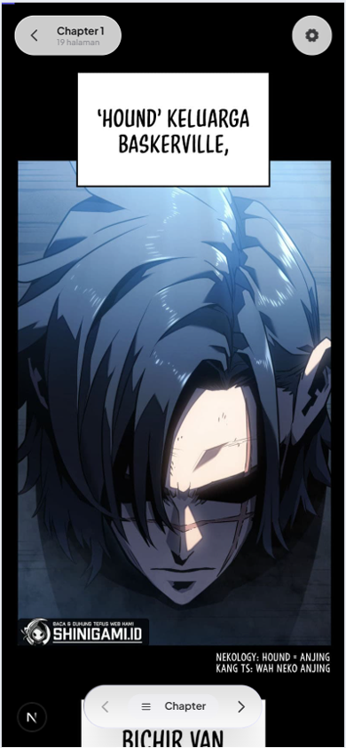

<div align="center">
  
</div>

<br />

<div align="center">
  <strong>A premium, native-like manga reader built for the modern web.</strong>
</div>

<br />

Yomirra is a progressive web application (PWA) designed to provide a seamless, cinematic reading experience. Built with a custom "Midnight Indigo Glassmorphism" design language, it prioritizes aesthetics, high performance, offline capabilities, and fluid interactions through native CSS View Transitions and spring physics.

## 🚀 Key Features

- **Immersive Reader Experience:** Continuous vertical scroll and paged modes optimized for webtoons and manga, featuring auto-hiding toolbars, gesture support, and WakeLock integration.
- **Cross-Device Sync:** Firebase-powered authentication and state synchronization for your library and reading history, ensuring you pick up right where you left off on any device.
- **Offline Chapter Downloads:** Built-in download manager utilizing the browser's Cache API to store chapters for offline reading, complete with background queueing and persistent state.
- **Extensible Source Adapter:** A server-side proxy architecture with HMAC-SHA256 signing to securely fetch and serve content from external sources (currently ships with Shinigami).
- **Progressive Web App (PWA):** Installable on iOS, Android, and Desktop, featuring offline caching powered by Serwist, safe-area handling, and standalone native-like UX.
- **High Performance:** Redis-backed SWR caching for external API endpoints, virtualized chapter lists for long-running series, and lazy-loaded image optimization.

## 🛠 Tech Stack

### Core & Framework
- **Next.js 16.2.5** (App Router + Turbopack)
- **React 19.2.4**
- **TypeScript 5.x** (Strict Mode)

### Styling & UI
- **Tailwind CSS v4**
- **Framer Motion 12.x** (`motion/react`)
- **Radix UI** Primitives
- **Phosphor Icons**

### State & Data
- **Zustand 5.x** (with IndexedDB `persist` middleware)
- **TanStack Query** (Client-side data fetching)
- **Firebase 12.x** (Auth & Firestore for cloud sync)

### Infrastructure & Caching
- **Upstash Redis** (API cache layer)
- **Serwist** (PWA & Service Worker)
- **Cache API** (Offline image storage)

## 📱 Previews

<div align="center">
  
  &nbsp;&nbsp;&nbsp;
  
</div>

## 📦 Getting Started

### Prerequisites
- Node.js 20+
- `pnpm` (strictly required, do not use npm/yarn)

### Installation

1. Clone the repository:
   ```bash
   git clone https://github.com/rzqllh/Yomirra.git
   cd Yomirra
   ```

2. Install dependencies:
   ```bash
   pnpm install
   ```

3. Configure Environment Variables:
   Copy `.env.example` to `.env` and fill in your Firebase and Redis credentials.
   ```bash
   cp .env.example .env
   ```

4. Start the development server:
   ```bash
   pnpm dev --turbo
   ```

## 🏗 Architecture

Yomirra enforces a strict feature-based architecture with clear boundaries between server and client logic:

- `/src/app/(web)`: Next.js App Router definitions, global CSS, and page layouts.
- `/src/components`: Domain-driven UI components (`/app`, `/manga`, `/reader`, `/history`, `/ui`).
- `/src/shared`: Client and server-safe utilities, Zustand stores, Firebase sync hooks, and API client.
- `/src/server`: Server-only logic including Redis caching strategies, HMAC image proxy, rate limiting, and source adapters.
- `/docs`: Comprehensive project guidelines defining API contracts, DB schema, design system tokens, UI/UX patterns, and agent rules.

## 📄 License

This project is open-sourced under the Apache 2.0 License.
