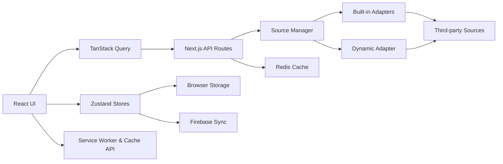

# Architecture Overview

Yomirra is a mobile-first Progressive Web App (PWA) manga reader built on Next.js 16 App Router. It features a client-side reader, server-side API routes, pluggable source adapters, persistent browser state, and optional cloud synchronization.

## High-Level Flow



---

## Layer Separation Rules

Maintaining clear layer separation is critical for security, stability, and bundle optimization.

### Layer 1: Server-Only (`src/server/`)
- Runs exclusively on the Node.js / Vercel server runtime.
- Has access to environment variables, Redis client, source adapters, and scraping logic.
- **MUST NOT** be imported in client components.
- **MUST NOT** import client-only SDKs such as `src/shared/lib/firebase.ts`.

### Layer 2: API Routes (`src/app/api/`)
- Acts as the bridge between client components and server adapters.
- Validates input using Zod schemas (`src/server/lib/validation/api.ts`).
- Returns standardized responses: `{ data: T }` on success, `{ error: { code, message } }` on failure.
- Resolves adapters dynamically via `SourceManager`.

### Layer 3: Shared (`src/shared/`)
- Contains utilities, types, and stores shared between client and server.
- Exception: `src/shared/lib/firebase.ts` and `src/shared/api-client.ts` are client-guarded modules.

### Layer 4: Client Components (`src/components/`, client page flows)
- Runs in the browser (`"use client"`).
- Reads and updates Zustand stores.
- Fetches data strictly via `ApiClient` (never calls server adapters directly).

### Layer Separation Examples

```tsx
// ❌ WRONG — importing server adapter in client component
import { SampleAdapter } from "@/server/lib/sources/adapters/sample-adapter";

// ❌ WRONG — importing client firebase SDK in API route
import { initFirebase } from "@/shared/lib/firebase"; // in /app/api/**

// ❌ WRONG — calling sourceManager directly in UI component
import { sourceManager } from "@/server/lib/sources/source-manager"; // in component

// ✅ CORRECT — client fetches via API route through ApiClient
import { apiClient } from "@/shared/api-client";
const result = await apiClient.getPopular(sourceId);
```

---

## Directory Structure

```text
src/
├── app/
│   ├── (web)/                   # Route group: user-facing pages
│   │   ├── layout.tsx           # Root layout (providers, shell)
│   │   ├── globals.css          # Design tokens + Tailwind @theme
│   │   ├── page.tsx             # Home
│   │   ├── manga/[sourceId]/[mangaId]/
│   │   │   ├── page.tsx         # Manga detail
│   │   │   └── read/[chapterId]/page.tsx  # Reader
│   │   ├── search/              # Multi-source search
│   │   ├── library/             # Library page
│   │   ├── downloads/           # Downloads page
│   │   ├── sources/             # Source browser
│   │   ├── updates/             # Update feed
│   │   ├── bookmark/            # Bookmarks
│   │   ├── popular/             # Popular feed
│   │   └── settings/            # Settings
│   │
│   ├── api/                     # Server API routes
│   │   ├── sources/             # Source endpoints
│   │   └── proxy/image/         # HMAC-verified image proxy
│   │
│   ├── manifest.ts              # PWA manifest
│   └── sw.ts                    # Service worker entry
│
├── components/                  # UI Components
│   ├── app/                     # App-level shell (header, navigation)
│   ├── manga/                   # Manga UI (cards, detail, chapter rows)
│   ├── reader/                  # Reader-specific UI
│   ├── search/                  # Search UI & drawers
│   ├── ui/                      # Base design system primitives
│   └── motion/                  # Motion-wrapped animation wrappers
│
├── server/                      # Server-Only Modules
│   └── lib/
│       ├── sources/             # Source manager & adapter registry
│       ├── cache/               # Redis caching (withCache wrapper)
│       └── security/            # Rate limiting & HMAC signing
│
└── shared/                      # Shared Contracts & Utilities
    ├── api-client.ts            # Typed HTTP client
    ├── hooks/                   # Custom React hooks
    ├── lib/                     # Motion tokens & download engine
    ├── sources/                 # Source contracts & types
    ├── store/                   # Zustand stores
    └── utils/                   # Pure utility functions
```

---

## Image Proxy & Hotlink Protection

External images must be requested via `/api/proxy/image` to bypass referrer restrictions and protect client privacy.

```text
Image Request Flow:
1. Client generates signed URL: signProxyUrl(originalUrl)
   → /api/proxy/image?url=<encoded>&sig=<hmac>
2. Server validates HMAC signature using IMAGE_PROXY_SECRET.
3. Server fetches image with appropriate Referer headers and streams back to client.
```

---

## Multi-Source Search Architecture

Search capabilities vary by source adapter:

1. **Filter Capability Discovery**: Fetch source capabilities via `/api/sources/[sourceId]/filters`.
2. **Payload Construction**: `buildPayloadForSource` maps active filters only to supported keys per source.
3. **Parallel Query Execution**: React Query runs per-source search requests in parallel.
4. **Exhaustion Guarding**: If a source returns `hasNextPage: false` on page `P`, subsequent queries for page `P+1` for that source are disabled automatically until search parameters or filters change.
5. **Deduplication & Merging**: Client interleaves and deduplicates items by title.

---

## Caching & Reliability

Server responses use Redis caching (`withCache`):

- **Fresh Hit**: Returns cached JSON payload when TTL is valid.
- **Cache Miss**: Executes fetcher, calculates expiration, and writes to Redis.
- **Stale Fallback**: If upstream source fails or returns 403/5xx (e.g. Komikindo WAF restriction), returns stale cache entry if available.
- **Bounded Rate Limit Retries**: MangaDex GET requests honor upstream `Retry-After` headers on `HTTP 429` with a bounded retry (max 1 attempt, 5000ms max sleep cap, process-local token bucket re-acquisition).
- **Diagnostics Normalization**: `/api/sources/health` returns normalized safe public messages without exposing internal stack traces or raw response headers.

---

## Offline Reading & Download Engine

Offline chapter reading utilizes browser Cache Storage and Serwist Service Worker:

1. Downloads are queued in `useDownloadStore`.
2. Pages are fetched, compiled via JSZip, and stored in Cache API (`yomirra-chapter-cache-v1`).
3. Service worker intercepts reader image requests and serves cached blobs when offline.

---

## State & Data Flow

### Local-First Persistence

The application heavily relies on client-side state persisted to `localStorage` through Zustand.
Currently, the following are **local-first** and **not** cloud-synced to Firebase:
- Updates (`UpdateStore`)
- Collections & Reading Statuses (`CollectionStore`)
- Automatic Scan Preferences & Muted Manga (`SettingsStore`)
- Download queues (`DownloadStore`)

*(Note: Firebase sync is planned for these in future iterations, while Library, History, and Bookmarks are synced).*

### Store Data Flows

- **Library & Updates**
  `LibraryStore` (source of truth for saved manga) → `UpdateChecker` (fetches latest chapter) → `UpdateStore` (stores unread updates) → `Updates Page / BottomDock` (displays unread badges).

- **Settings & Notification Preferences**
  `SettingsStore` (stores user preferences) → Controls automatic scan intervals and filters unread updates / muted manga from badges.

- **Collections & Organization**
  `CollectionStore` (stores custom collections and statuses) → Populates `Manga Detail` actions, provides client-side filters for `Library` page, and exports to `Backup Engine`.

---

## Backup Engine

To support local-first data, Yomirra includes a Backup Engine that exports/imports Zustand state.

- **Schema V1 Compatibility**: Seamlessly imports older backups without `collections` or `updates`.
- **Schema V2 Export**: Exports the current application state including custom collections, memberships, and reading statuses.
- **Dry-Run**: Analyzes the import payload before committing to give the user a preview of changes.
- **Merge & Replace Strategy**: Users can choose to merge imported data with existing state or replace it entirely.
- **Rollback**: If a setter fails during restoration, the entire state is reverted to prevent data corruption.
