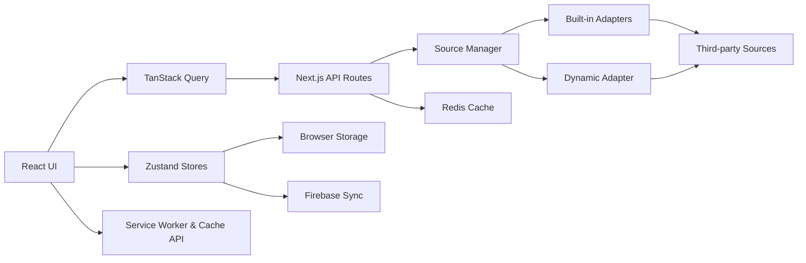

# Architecture Overview

Yomirra is a mobile-first Progressive Web App manga reader built on Next.js 16 App Router. The application combines client-side feature flows, server API routes, pluggable source adapters, persistent browser state, optional cloud synchronization, server caching, and offline reader support.

## High-Level Flow



## Runtime Layers

### Server-only: `src/server/`

- Runs on the server runtime.
- Owns source adapters, scraping/API integration, Redis access, and server security helpers.
- Must not be imported into client components.
- Must not depend on browser-only SDKs.

### API routes: `src/app/api/`

- Bridge browser-facing code to server-only source integrations.
- Validate external input at the boundary.
- Resolve source adapters through the source manager.
- Return normalized public response and error shapes rather than leaking upstream internals.

### Shared: `src/shared/`

- Contains cross-feature types, utilities, stores, source contracts, API client code, and reusable hooks.
- Some modules are explicitly client-oriented, so `shared` does not mean every file is safe in every runtime.

### Client UI: `src/components/` and interactive route flows

- Owns browser interaction and presentation.
- Uses Zustand for established client state and TanStack Query for request/server state.
- Reaches source data through the API client/API routes instead of importing server adapters.

```tsx
// Wrong: server implementation in client code
import { sourceManager } from "@/server/lib/sources/source-manager";

// Correct: browser-facing code goes through the API client
import { apiClient } from "@/shared/api-client";
```

## Route → Feature View → Controller Hook

Complex client routes are intentionally thin. The route file owns the App Router boundary (and `Suspense` when required), while feature composition and client orchestration live outside the route file.

```text
app route
   ↓
feature page view
   ↓
feature components + controller hook(s)
   ↓
shared stores / TanStack Query / API client
```

Current examples:

```text
/library
  app/(web)/library/page.tsx
    → components/library/library-page-view.tsx
      → useLibraryCatalog()
      → LibraryToolbar
      → LibraryStatusRail
      → LibraryCollectionRail
      → LibraryResults

/bookmark
  app/(web)/bookmark/page.tsx
    → components/bookmark/bookmark-page-view.tsx
      → ReadingTab
      → CollectionTab
      → useBookmarkReading()
      → useBookmarkCollection()

/search
  app/(web)/search/page.tsx
    → components/search/search-page-view.tsx
      → useSearchCatalog()
      → SearchToolbar
      → SearchSourceRail
      → SearchResults
```

This is a responsibility boundary, not a line-count target. Do not split a feature merely to make files shorter; extract code when state ownership, data orchestration, or presentation responsibility becomes clearer.

## Canonical UI Boundaries

### Page headers

`PageHeader` is the canonical section/destination header. It owns the responsive mobile fixed header and desktop hero-style header contract. Feature pages provide title, description, icon, actions, and optional metadata; they should not rebuild the same responsive header chrome locally.

### Filter drawers

Library and Search filters use `FilterDrawerShell` + `FilterSection`. The shell owns Vaul presentation, overlay, header/reset/apply chrome, scrolling, and safe-area footer behavior. Each feature retains its own filter state and source-specific business logic.

Do not move Library/Search filter semantics into the shell.

### Manga presentation

Shared low-level primitives include:

- `MangaCover` — cover loading/error/fallback behavior.
- `ReadingProgress` — semantic 0–100 progress rendering.
- `MangaGrid` — canonical responsive manga grid.

Card archetypes remain separate (`ShelfCard`, `HistoryCard`, `EditorialCard`, `LeaderboardRow`). They share primitives instead of being collapsed into a single variant-heavy mega component.

`MangaGridSkeleton` consumes the same `MANGA_GRID_CLASS` as `MangaGrid`, keeping loading and loaded grid breakpoints aligned.

### Reader panels

Reader overlays form a separate family from app/filter drawers. `ReaderPanelShell` uses Motion and owns shared reader-panel infrastructure such as backdrop, header, dismiss behavior, scrolling, and the existing `bottom-dialog` / `side-panel` desktop layouts.

`ReaderChapterDrawer` and `ReaderSettingsDrawer` keep their business state and content. Do not replace Reader panels with `FilterDrawerShell`, and do not turn either shell into a universal app-wide drawer abstraction.

## Directory Structure

```text
src/
├── app/
│   ├── (web)/                       # User-facing routes and loading states
│   ├── api/                         # Server API routes and image proxy
│   ├── manifest.ts                  # PWA manifest
│   └── sw.ts                        # Service worker entry
│
├── components/
│   ├── app/                         # App shell, navigation, PageHeader
│   ├── ui/                          # Base/canonical reusable UI primitives
│   ├── manga/                       # MangaCover, MangaGrid, cards, detail UI
│   ├── library/                     # Library feature UI
│   ├── bookmark/                    # Bookmark reading/collection UI
│   ├── search/                      # Search feature UI
│   ├── reader/                      # Reader UI and ReaderPanelShell
│   ├── skeletons/                   # Loading-state components
│   ├── settings/                    # Settings feature components
│   └── updates/                     # Update-feed components
│
├── server/
│   └── lib/
│       ├── sources/                 # Source manager and adapter registry
│       ├── cache/                   # Redis caching
│       └── security/                # Server security helpers
│
└── shared/
    ├── api-client.ts                # Browser-facing typed HTTP client
    ├── hooks/                       # Shared and feature-controller hooks
    ├── lib/                         # Backup, update, motion, routes, downloads
    ├── sources/                     # Source contracts and dynamic registry
    ├── store/                       # Zustand stores
    ├── types/                       # Shared domain/schema types
    └── utils/                       # Pure utilities
```

## Multi-Source Search

Search capabilities vary by source adapter:

1. Filter capabilities are discovered per selected source.
2. Active filters are mapped only to keys supported by each source.
3. TanStack Query executes per-source requests in parallel.
4. A source that reports no next page is not needlessly re-queried for later pages until relevant search inputs change.
5. Results are merged/deduplicated client-side while partial source failures can be surfaced without discarding successful sources.

Feature state belongs to `useSearchCatalog`; filter presentation remains in the canonical filter shell.

## Images and Proxying

Yomirra does not use one universal path for every remote image.

- Manga cover presentation is centralized through `MangaCover`, which renders a standard `` with `referrerPolicy="no-referrer"`, async decoding, lazy/eager loading, and fallback handling.
- Sources or reader flows that require protected/hotlink-sensitive image access can use signed `/api/proxy/image` URLs.
- The server proxy validates its signature before fetching a protected remote URL.

Do not replace cover rendering with Next.js `<Image>` solely for consistency; source restrictions and remote-image behavior are part of the current contract.

## Caching and Source Reliability

Server responses can use Redis caching around source requests:

- valid cached data may satisfy a request without hitting the upstream source;
- source integrations may fall back to stale cached data for supported upstream failures;
- MangaDex HTTP 429 handling uses bounded `Retry-After` behavior rather than unbounded retry loops;
- health responses normalize public diagnostics instead of exposing raw stack traces or private response headers.

Source availability is external and can change independently of Yomirra. Documentation should distinguish a verified application behavior from the current health of a third-party source.

## Offline Reading and Downloads

Offline chapter support uses the browser download store, Cache Storage, and the Serwist service worker. Reader code may create local/blob-backed image URLs for cached pages and must clean them up when appropriate.

PWA/offline behavior is browser- and device-sensitive. Unit tests do not replace real-browser or device verification for storage limits, service-worker routing, or offline cache behavior.

## State and Data Flow

Yomirra uses a local-first client architecture. Zustand stores own established persistent browser state; selected stores also participate in Firebase synchronization. TanStack Query owns remote request state.

Examples:

- Library state feeds saved manga, collection/filter experiences, update checking, and backup.
- History state feeds reading progress and Bookmark's reading tab.
- Settings and source preferences affect source visibility, reader behavior, and update-related preferences.
- Download state owns offline download queue/status.

When changing persistence or backup schemas, preserve backward compatibility intentionally and add migration/restore coverage.

## Backup Engine

The Backup & Restore flow supports the current persisted application schema, including backward compatibility for older backups where implemented. Import is validated before committing state, and merge/replace behavior should remain transactional enough to avoid partial restoration when a setter fails.

Schema details belong in [SCHEMA.md](SCHEMA.md); UI implementation details belong in [COMPONENTS.md](COMPONENTS.md).
